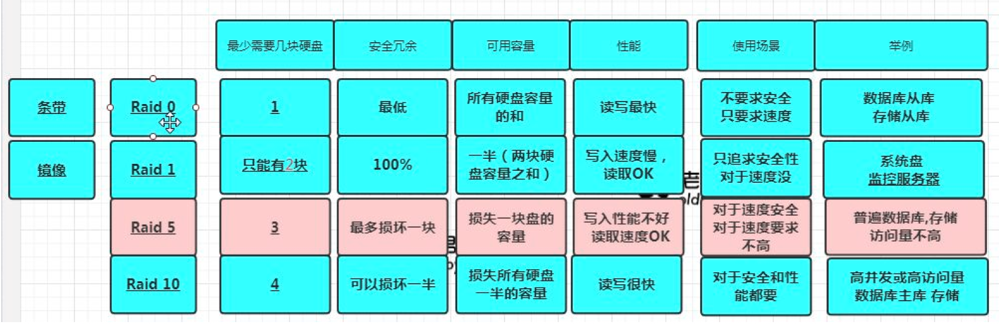
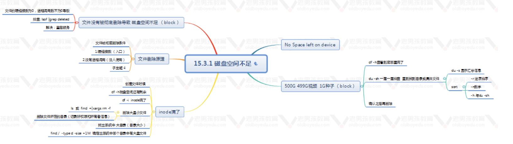

# 今日内容

- 磁盘
- linux优化

## 磁盘

- 特点
  - 获取更高容量
  - 获取更高性能
  - 获取更高冗余(安全性)
- RAID0，RAID1，RAID5

- 命令

  - fdisk
    - p print 显示磁盘分区信息
    - n new 创建磁盘分区
    - d 删除
    - w 保存退出
  - mkds.xfs  路径
  - man 文件名

  - mount  目录挂载
  - umount 目录卸载
  - df -h 查询磁盘使用情况
  - free -h 查看内容使用情况
  - lsof
  - wc
  - find / -type d -size+1M 确定系统中哪个目录中有大量文件

- 磁盘分区流程
  - 磁盘分区
  - 格式化("创建文件系统")
  - 挂载

- 场景

  JAVA程序可能会占用内容，内存不足，我们可能增加`swap`, 如何增加`swap`

  查看`swap`可以使用查看内容使用情况的命令.

  增加

  dd if=/dev/zero of=/tmp/500m bs=1m count=500

  - if=文件名：输入文件名，缺省为标准输入。即指定源文件。
  - of=文件名：输出文件名，缺省为标准输出。即指定目的文件。
  - count=blocks：仅拷贝blocks个块，块大小等于ibs指定的字节数。
  - bs=bytes：同时设置读入/输出的块大小为bytes个字节。

- 没有被彻底删除导致, 磁盘空间不足
  - 文件的硬连接数为0，进程调用数不为0导致
  - 排查 lsof |grep deleted
  - 解决：重启服务

## linux优化

- centos6.9与centos7.0的区别

- 网络管理服务    
- mysqld优化                                                                                                                                        
- yum源(配置yum源)
- 防火墙

- 文件描述符
- linux优化体系
  - 系统
  - 服务
  - 安全优化

多台服务器要进行克隆
