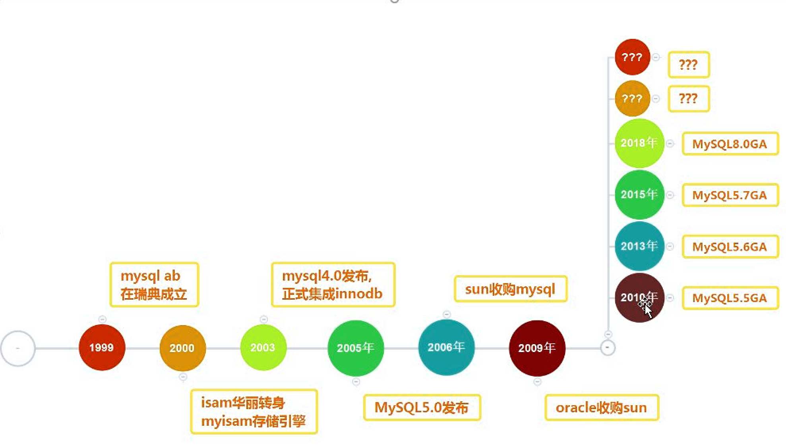
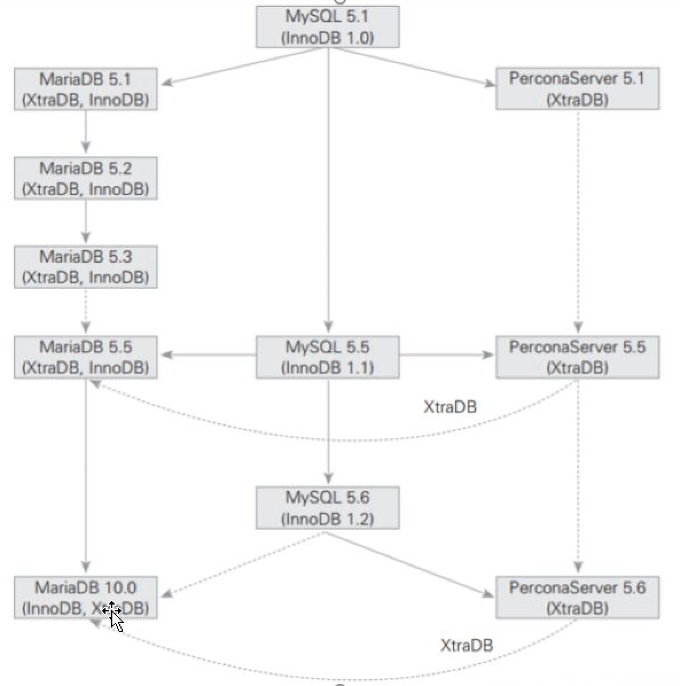

# 今日内容

- 数据库
- 经典架构
  - LNMP
  - LAMP
  - LNMT

## 介绍

- NewSQL
  - googleSpanner
  - pingCAPTiDB
  - AliOceanBase

## Mysql发展史



### 分支对比



## 规划和安装

- yum安装

```
$ rpm -qa | grep mysql  # 检测是否安装mysql
$ rpm -e mysql　　       # 普通删除模式
$ rpm -e --nodeps mysql　# 强力删除模式，如果使用上面命令删除时，提示有依赖的其它文件，则用该命令可以对其进行强力删除
```

安装

```
$ wget http://repo.mysql.com/mysql-community-release-el7-5.noarch.rpm
$ rpm -ivh mysql-community-release-el7-5.noarch.rpm
$ yum update
$ yum install mysql-server
```

权限设置：

```
$ chown mysql:mysql -R /var/lib/mysql
```

初始化 MySQL：

```
$ mysqld --initialize
```

启动 MySQL：

```
$ systemctl start mysqld
```

查看 MySQL 运行状态：

```
$ systemctl status mysqld
```

在成功安装 MySQL 后，一些基础表会表初始化，在服务器启动后，你可以通过简单的测试来验证 MySQL 是否工作正常。

使用 mysqladmin 工具来获取服务器状态：

使用 mysqladmin 命令俩检查服务器的版本, 在 linux 上该二进制文件位于 /usr/bin 目录，在 Windows 上该二进制文件位于C:\mysql\bin 。

```
$ mysqladmin --version
```

linux上该命令将输出以下结果，该结果基于你的系统信息：

```
> mysqladmin  Ver 8.23 Distrib 5.0.9-0, for redhat-linux-gnu on i386
```

如果以上命令执行后未输出任何信息，说明你的Mysql未安装成功。

Mysql安装成功后，默认的root用户密码为空，你可以使用以下命令来创建root用户的密码：

```
$ mysqladmin -u root password "new_password";
```

现在你可以通过以下命令来连接到Mysql服务器：

```
$ mysql -u root -p
Enter password:*******
```

## 基本

- 建立用户
- 授权
- 连接管理
  - socket(套接字文件)
    - 只允许本地连接
  - TCPIP(网络IP+PORT)
    - 通过ip+端口号

- 分类

  - DDL 数据定义语言
    - select 
      - 函数应用，select database()
      - 参数查询，select @@port， @@datadir  
    - from
      - 表、视图、子查询
  - DCL 数据控制语言
    - grant
    - deny
    - revoke
  - DML 数据操作语言
    - insert
    - update
    - delete
  - DQL 数据查询语言
    - where
      - 等值
      - 比较判断符
      - 逻辑连接符
      - 模糊查询
    - group by
    - having
      - 使用临时表解决having面对结果集比较大的情况
    - order by limit 
    - 其它
      - between
      - and
      - in
      - exist
      - union all

- 一条sql是在数据库中如何进行查询的？

  - from 打开表
  - where  会走索引
  - 分组
  - select
  - having 结果集进行再次过滤
  - 排序 进行 limit 

  

